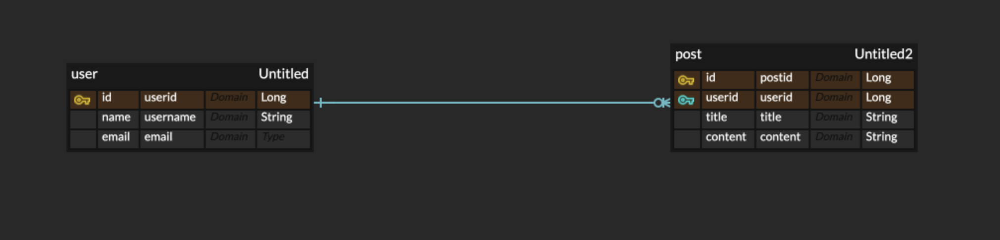

# 가수 생성 및 삭제, 음악 CRUD 코드 구현

## 1. ERD

- 한 명의 유저가 여러 개의 글을 작성할 수 있는 1:N 관계
- post 테이블의 userid는 user 테이블의 id를 참조하는 외래키
- 각 테이블의 id는 AUTO_INCREMENT 설정이 되어있음

## 2. 유저 생성, 조회, 삭제

- [x]  id 자동 증가를 위한 Identity 전략 지정
- [x]  한 명의 유저가 여러 개의 글을 작성할 수 있으므로, OneToMany 어노테이션 사용을 통한 일대다 관계 설정
- [x]  유저 없이 글 홀로 남겨지면 자동으로 삭제될 수 있도록 cascade, orphanremoval 옵션 추가

- [x]  사용자로부터 유저 이름과 이메일을 입력받을 수 있도록 Request 구현
- [x]  사용자가 생성된 유저의 id, 이름, 이메일을 볼 수 있도록 Response 구현

- [x]  UserService에서 데이터베이스를 참조할 수 있도록 JpaRepository 상속받는 UserRepository 생성

- [x]  유저 생성 성공 시 201 CREATE와 Response 전송
- [x]  유저 조회 시, 유저 id 존재하지 않으면 예외
- [x]  존재하면 200 OK + 유저 Response
- [x]  삭제 성공 시 204 NO CONTENT 전송
- [x]  삭제하려는 유저 id 없을 시 예외

## 3. 포스트 CRUD 구현

- [x]  id 자동 증가를 위한 Identity 전략 지정
- [x]  유저 테이블의 id와 연동하기 위한 조인

- [x]  사용자로부터 유저 id와 제목, 내용 입력받을 수 있도록 Request 구현
- [x]  사용자가 생성된 글의 id, 유저 id, 제목, 내용을 볼 수 있도록 Response 구현

- [x]  PostService에서 데이터베이스를 참조할 수 있도록 JpaRepository 상속받는 PostRepository 생성

- [x]  생성 시, 유저 id  존재하지 않으면 예외
- [x]  존재하면 201 CREATE + Response
- [x]  조회 시, 포스트 id 존재하지 않으면 예외
- [x]  존재하면 200 OK + Response
- [x]  조회는 읽기 전용으로 설정하여 메모리 최적화
- [x]  업데이트 시, user id, post id 없으면 예외
- [x]  존재하면 200 OK + Response
- [x]  삭제 시, post id 없으면 예외
- [x]  존재하면 204 NO CONTENT 응답