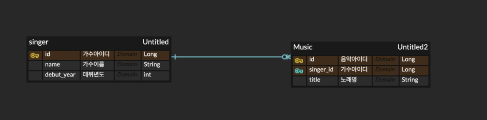

# 가수 생성 및 삭제, 음악 CRUD 코드 구현

## 1. ERD

- 한 명의 가수가 여러 곡의 음악을 가질 수 있는 1:N 관계
- 음악 테이블의 singer_id는 가수 테이블의 기본키인 id를 참조하는 외래키
- 각 테이블의 id는 AUTO_INCREMENT 설정이 되어있음

## 2. 가수 생성 및 삭제

- [ ]  id 자동 증가를 위한 Identity 전략 지정
- [ ]  한 명의 가수가 여러 곡의 음악을 가질 수 있으므로, OneToMany 어노테이션 사용을 통한 일대다 관계 설정
- [ ]  가수 없이 노래 홀로 남겨지면 자동으로 삭제될 수 있도록 cascade, orphanremoval 옵션 추가

- [ ]  사용자로부터 가수 이름과 데뷔년도를 입력받을 수 있도록 Request 구현
- [ ]  사용자가 생성된 가수의 id, 이름, 데뷔년도를 볼 수 있도록 Response 구현

- [ ]  SingerService에서 데이터베이스를 참조할 수 있도록 JpaRepository 상속받는 SingerRepository 생성

- [ ]  가수 생성 성공 시 201 CREATE와 Response 전송
- [ ]  삭제 성공 시 204 NO CONTENT 전송
- [ ]  삭제하려는 가수 id 없을 시 예외

## 3. 음악 CRUD 구현

- [ ]  id 자동 증가를 위한 Identity 전략 지정
- [ ]  가수 테이블의 id와 연동하기 위한 조인

- [ ]  사용자로부터 가수 id와 노래 제목 입력받을 수 있도록 Request 구현
- [ ]  사용자가 생성된 음악의 id, 제목, 가수 id, 이름을 볼 수 있도록 Response 구현

- [ ]  MusicService에서 데이터베이스를 참조할 수 있도록 JpaRepository 상속받는 MusicRepository 생성

- [ ]  음악 생성 시, 가수 id  존재하지 않으면 예외
- [ ]  존재하면 201 CREATE + 음악 Response
- [ ]  음악 조회 시, 음악 id 존재하지 않으면 예외
- [ ]  존재하면 200 OK + 음악 Response
- [ ]  조회는 읽기 전용으로 설정하여 메모리 최적화
- [ ]  음악 업데이트 시, music id, singer id 없으면 예외
- [ ]  존재하면 200 OK + 음악 Response
- [ ]  음악 삭제 시, music id 없으면 예외
- [ ]  존재하면 204 NO CONTENT 응답